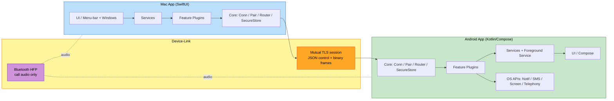

# Component Dependencies — android_bridge

## Dependency Matrix (within each app)

| Component | Depends on | Communication |
|---|---|---|
| App Shell (Mac/Android) | Services, PluginRegistry | direct calls / view-models |
| DiscoveryService | DeviceDiscovery, ConnectionService | callbacks |
| PairingService | PairingManager, SecureStore | direct calls |
| ConnectionService | ConnectionManager, MessageRouter | direct calls + state stream |
| Feature Services (C1–C7) | ConnectionService, their Plugin | direct calls + streams |
| PermissionService | platform permission APIs | direct calls |
| ConnectionManager | SecureStore (certs), MessageCodec, FrameCodec | network I/O (mTLS) |
| PairingManager | SecureStore, MessageCodec | direct calls |
| MessageRouter | MessageTypeRegistry, Plugins | dispatch |
| DeviceDiscovery | OS mDNS APIs | OS callbacks |
| Plugins (C1–C7) | OS feature APIs, MessageCodec/FrameCodec | OS APIs + messages |
| SecureStore | Keychain / Keystore | OS APIs |
| LinkLogger | (used by all) | direct calls |

**Cross-device dependency**: the only link between the two apps is the **Device-Link Protocol over mutual TLS**. No app calls the other directly; everything is messages/streams. Call **audio** depends on **Bluetooth HFP** (OS-level, outside the protocol).

## Layering (acyclic)
```
App Shell / UI
      │
   Services (orchestration)
      │
 Plugins ── Core (Connection, Pairing, Discovery, Router, SecureStore, Logger)
      │                     │
  OS feature APIs      Device-Link Protocol  ── mTLS ──▶ peer device
```

## Data-Flow Diagram



## Communication Patterns
- **Control**: length-prefixed JSON messages over the mTLS session, dispatched by `MessageRouter`.
- **Bulk**: binary frames (file chunks, screen frames) over a stream on the same session.
- **State**: `ConnectionService` exposes a connection-state stream to the UI.
- **Audio (calls)**: Bluetooth HFP at the OS level — never traverses the protocol.
- **Trust boundary**: every inbound message is validated + safely deserialized before reaching a plugin (CC-VALID, SECURITY-05/-13); unpinned peers are rejected at the TLS layer (CC-SEC).
