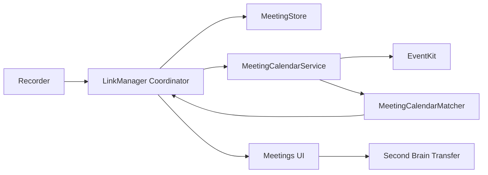

# Component Dependencies — Meeting Completion and Calendar Enrichment

## Dependency Matrix

| Component | Depends on | Communication |
|---|---|---|
| Meetings UI | LinkManager, MeetingRecord | Published state and user actions |
| LinkManager | MeetingStore, MacMeetingRecorder, MeetingCalendarService | Direct method calls and callbacks |
| MeetingCalendarService | EventKit | Read-only platform API |
| MeetingCalendarMatcher | Calendar domain snapshots | Pure values |
| MeetingStore | Foundation filesystem | Local atomic files |
| MacMeetingRecorder | MeetingStore, Whisper service | Serial background queue |
| SecondBrainExporter | MeetingRecord, SecondBrain CLI | Explicit user action only |

## Data Flow

### Text Alternative

Recorder completion enters LinkManager coordination. LinkManager persists state through MeetingStore, reads calendar events through MeetingCalendarService/EventKit, applies pure matching, and publishes results to the Meetings UI. Second Brain transfer starts only from an explicit UI action.

## Coupling Rules

- EventKit types do not enter MeetingStore or SwiftUI state; use Codable snapshots.
- Pure matching logic does not import EventKit.
- Calendar failures do not change transcript/media availability.
- Second Brain remains independent from completion and enrichment.
