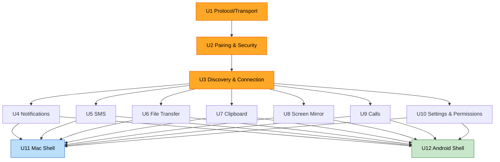

# Unit of Work — Dependencies — android_bridge

## Dependency Matrix

| Unit | Depends on | Type | Notes |
|------|-----------|------|-------|
| **U1** Protocol/Transport | — | — | Foundation; consumed by every other unit (codecs + type registry). |
| **U2** Pairing & Security | U1 | hard | Uses Message codec for pairing exchange; produces trust material U3 needs. |
| **U3** Discovery & Connection | U1, U2 | hard | mTLS needs pinned certs (U2); routing/streams need codecs (U1). |
| **U4** Notifications | U3 | hard | Sends/receives over the connection + router. |
| **U5** SMS | U3 | hard | Same. |
| **U6** File Transfer | U3 | hard | Needs binary streams from ConnectionManager. |
| **U7** Clipboard | U3 | hard | Same. |
| **U8** Screen Mirror | U3 | hard | Needs binary streams (frames). |
| **U9** Calls | U3 | hard | Control over link; audio is OS-level BT HFP (no unit dependency). |
| **U10** Settings & Permissions | U3 (light) | soft | Cross-cuts U4–U9 (toggles/permissions gate each feature). |
| **U11** Mac App Shell | U2–U10 | integration | Composes Core + plugins + services into the SwiftUI app. |
| **U12** Android App Shell | U2–U10 | integration | Composes the same into the Compose app + foreground service. |

**Cross-device coupling**: none unit-to-unit across devices — the *only* cross-device contract is
U1 (the protocol) carried over U3's mTLS link. Call **audio** depends on Bluetooth HFP (OS-level),
outside all units.

## Critical path

```
U1 ──▶ U2 ──▶ U3 ──┬──▶ U4
                   ├──▶ U5
                   ├──▶ U6
                   ├──▶ U7
                   ├──▶ U8
                   ├──▶ U9
                   └──▶ U10 (cross-cuts U4–U9)
                            │
                   U11 (Mac) + U12 (Android)  ◀── integrate U2–U10
```

- **U1 → U2 → U3** is the strict serial foundation (the longest required chain).
- **U4–U9** are mutually independent — buildable in any order or in parallel.
- **U10** is best built alongside/just-after the first feature so toggles+permissions exist early,
  then extended as each feature lands.
- **U11/U12** are last — they wire everything into shippable apps.



## Walking-skeleton milestone (Q4)
After **U1 + U2 + U3**, deliver a thin vertical slice — pair, auto-discover, connect over mTLS,
and round-trip one trivial message rendered in both UIs — before starting feature units. This
proves the highest-risk plumbing (cross-OS mTLS, discovery, framing) end-to-end early.
