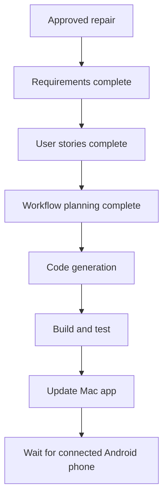

# Execution plan: clipboard and Second Brain reliability

## Analysis

- **Project:** Brownfield Kotlin/Swift monorepo.
- **Risk:** Medium. Clipboard privacy and external file updates span both apps, but no protocol or infrastructure migration is needed.
- **User-facing impact:** Clipboard settings/notification and Second Brain status/freshness.
- **Structural impact:** None. Existing `LinkManager`, `SecondBrainStore`, `SecondBrainFolder`, and UI boundaries remain.
- **Protocol impact:** None. Existing `clip.update` remains.
- **Dependencies:** No additions.

## Component relationships

- Android `MainActivity` uses Android `LinkManager` clipboard and Second Brain state.
- Android `LinkManager` uses `SecondBrainFolder` and the existing TLS sender.
- Mac SwiftUI uses Mac `LinkManager` state/actions.
- Mac `LinkManager` uses `SecondBrainStore` and existing TLS transport.
- Syncthing remains external and unchanged.

## Workflow visualization

Text alternative: approved repair, requirements, focused stories, workflow plan, code generation, build/test, Mac update, then Android hardware installation.

## Stage decisions

### Inception

- [x] Workspace Detection: complete.
- [x] Reverse Engineering: skipped; current implementation and prior artifacts were inspected directly.
- [x] Requirements Analysis: complete under explicit implementation authorization.
- [x] User Stories: execute and complete because workflows change on both apps.
- [x] Workflow Planning: complete.
- [x] Application Design: skip; no new component or service.
- [x] Units Generation: skip; one cohesive repair inside existing component boundaries.

### Construction

- [x] Functional Design: skip; existing clipboard rules and Syncthing decision define behavior.
- [x] NFR Requirements: skip; existing platform, security, and test frameworks remain.
- [x] NFR Design: skip because NFR Requirements is skipped.
- [x] Infrastructure Design: skip; Syncthing topology is unchanged.
- [ ] Code Generation: execute.
- [ ] Build and Test: execute.

## Change sequence

1. Add failing policy and refresh-detection tests.
2. Implement clipboard settings and Android Copy notification.
3. Implement Mac and Android Second Brain refresh/error/status behavior.
4. Run Android and Mac tests/builds.
5. Package, sign, install, and relaunch the Mac app.
6. Wait for phone connection before Android APK installation and hardware verification.

## Success criteria

- Requirements acceptance criteria pass where automatable.
- Existing tests remain green.
- No new dependency.
- Existing uncommitted work remains intact.
- Android APK is ready for later installation.
