# Direct distribution packaging execution plan

## Detailed analysis summary

### Transformation scope

- **Transformation type**: Cross-platform distribution and trusted-update enhancement in an existing monorepo.
- **Primary changes**: Version contract, GitHub release workflow, macOS DMG, Android release signing, release manifest, Mac update client, Android update client, supply-chain checks, tests, and maintainer documentation.
- **Related components**: `.github/workflows/release-macos.yml`, `mac/scripts/make-macos-app.sh`, macOS BridgeCore and BridgeApp, Android Gradle configuration and app UI, setup wizard links, `README.md`, and new release documentation.

### Change impact assessment

- **User-facing changes**: Yes. Direct DMG and APK installation plus update prompts on both platforms.
- **Structural changes**: Yes. New release metadata contract and updater components in Swift and Kotlin.
- **Data model changes**: Small. New version, release manifest, updater state, and downloaded-artifact metadata types.
- **API changes**: External read-only use of GitHub Releases. No Android Bridge device-link protocol changes.
- **NFR impact**: High. Signing key continuity, checksum and certificate verification, secret handling, SBOM generation, dependency scanning, fail-closed updates, and cleanup are release blockers.

### Component relationships

- **Release contract**: A root version source and generated release manifest define version, version code, asset names, hashes, and Android signing certificate fingerprint.
- **macOS packaging**: `mac/scripts/make-macos-app.sh` consumes version metadata and builds the existing native app. CI wraps it in a DMG.
- **Android packaging**: `android/app/build.gradle.kts` consumes version and CI-only signing inputs to build the release APK.
- **macOS updater**: BridgeCore reads the stable release manifest, compares versions, downloads and verifies the DMG, then BridgeApp asks the user and opens the verified DMG.
- **Android updater**: Kotlin core reads the same stable release manifest, compares versions, downloads and verifies the APK plus signer, then MainActivity invokes Android's package installer after user approval.
- **Documentation**: README and maintainer release instructions describe installation, Gatekeeper limits, signing secrets, key backup, and release commands.

### Risk assessment

- **Risk level**: High.
- **Why**: A bad release can strand Android upgrades, expose signing secrets, or distribute an unverifiable artifact. Update code handles downloaded executables.
- **Rollback complexity**: Moderate. Updater UI and CI changes can be reverted, but a lost or changed Android signing key cannot repair already installed copies.
- **Testing complexity**: Complex. Unit tests, local packaging checks, CI syntax checks, APK signature checks, DMG mount checks, and real-device installation remain necessary.

## Module update strategy

- **Update approach**: Hybrid.
- **Critical path**: Release contract and signing pipeline first.
- **Parallel work**: Mac and Android updater units can proceed after the manifest contract is fixed.
- **Coordination points**: Semantic version rules, asset names, manifest schema, checksums, and Android signer fingerprint.
- **Integration checkpoint**: Build one local release set, serve its metadata and artifacts from a controlled test source, and verify both clients reject modified payloads.
- **Rollback**: Keep the existing rolling ZIP/debug workflow functional until the release DMG and signed APK validations pass. Do not publish a stable tag from this implementation session.

## Workflow visualization

```mermaid
flowchart TD
    Start(["Distribution request"]) --> WD["Workspace Detection: COMPLETE"]
    WD --> RE["Reverse Engineering: SKIP"]
    RE --> RA["Requirements Analysis: COMPLETE"]
    RA --> US["User Stories: SKIP"]
    US --> WP["Workflow Planning: COMPLETE"]
    WP --> AD["Application Design: EXECUTE"]
    AD --> UG["Units Generation: EXECUTE"]
    UG --> FD["Functional Design: EXECUTE"]
    FD --> NFRA["NFR Requirements: EXECUTE"]
    NFRA --> NFRD["NFR Design: EXECUTE"]
    NFRD --> ID["Infrastructure Design: SKIP"]
    ID --> CG["Code Generation: EXECUTE"]
    CG --> BT["Build and Test: EXECUTE"]
    BT --> End(["Complete"])

    style WD fill:#4CAF50,stroke:#1B5E20,stroke-width:3px,color:#fff
    style RA fill:#4CAF50,stroke:#1B5E20,stroke-width:3px,color:#fff
    style WP fill:#4CAF50,stroke:#1B5E20,stroke-width:3px,color:#fff
    style AD fill:#FFA726,stroke:#E65100,stroke-width:3px,stroke-dasharray:5 5,color:#000
    style UG fill:#FFA726,stroke:#E65100,stroke-width:3px,stroke-dasharray:5 5,color:#000
    style FD fill:#FFA726,stroke:#E65100,stroke-width:3px,stroke-dasharray:5 5,color:#000
    style NFRA fill:#FFA726,stroke:#E65100,stroke-width:3px,stroke-dasharray:5 5,color:#000
    style NFRD fill:#FFA726,stroke:#E65100,stroke-width:3px,stroke-dasharray:5 5,color:#000
    style CG fill:#4CAF50,stroke:#1B5E20,stroke-width:3px,color:#fff
    style BT fill:#4CAF50,stroke:#1B5E20,stroke-width:3px,color:#fff
    style RE fill:#BDBDBD,stroke:#424242,stroke-width:2px,stroke-dasharray:5 5,color:#000
    style US fill:#BDBDBD,stroke:#424242,stroke-width:2px,stroke-dasharray:5 5,color:#000
    style ID fill:#BDBDBD,stroke:#424242,stroke-width:2px,stroke-dasharray:5 5,color:#000
    style Start fill:#CE93D8,stroke:#6A1B9A,stroke-width:3px,color:#000
    style End fill:#CE93D8,stroke:#6A1B9A,stroke-width:3px,color:#000
    linkStyle default stroke:#333,stroke-width:2px
```

### Text alternative

1. Workspace Detection: complete.
2. Reverse Engineering: skipped because current project records and inspected code cover the affected boundaries.
3. Requirements Analysis: complete.
4. User Stories: skipped because requirements already define the two installation and update journeys with acceptance criteria.
5. Workflow Planning: complete, approval pending.
6. Application Design: execute.
7. Units Generation: execute.
8. Functional Design: execute per unit where update or release state needs detailed rules.
9. NFR Requirements: execute for signing, integrity, supply-chain, compatibility, and failure behavior.
10. NFR Design: execute to bind those controls to concrete components.
11. Infrastructure Design: skip because no hosted application infrastructure is introduced. GitHub Actions remains implementation tooling.
12. Code Generation: execute for all units.
13. Build and Test: execute across release tooling, Swift, Kotlin, DMG, and APK outputs.

## Phases to execute

### Inception

- [x] Workspace Detection - completed.
- [x] Reverse Engineering - skipped; current project records plus direct code inspection are sufficient.
- [x] Requirements Analysis - approved by the user's request to implement the entire feature.
- [x] User Stories - skipped; requirements contain explicit installation and update journeys.
- [x] Workflow Planning - plan generated; approval pending.
- [ ] Application Design - execute.
  - **Rationale**: New release-manifest, updater, downloader, verifier, and platform installer boundaries require named responsibilities and dependencies.
- [ ] Units Generation - execute.
  - **Rationale**: Release tooling, Mac updater, and Android updater are separate units with one shared contract.

### Construction

- [ ] Functional Design - execute where applicable per unit.
  - **Rationale**: Version ordering, update states, asset selection, user confirmation, cleanup, and failure transitions need explicit rules.
- [ ] NFR Requirements - execute per unit.
  - **Rationale**: Public artifact security and signing-key continuity are blocking constraints.
- [ ] NFR Design - execute per unit.
  - **Rationale**: Verification, secret handling, supply-chain checks, and fail-closed behavior need concrete implementation mappings.
- [x] Infrastructure Design - skipped.
  - **Rationale**: No cloud service, server, network, or persistent infrastructure is added.
- [ ] Code Generation - execute.
  - **Rationale**: Release scripts, CI, Swift, Kotlin, tests, and documentation must change.
- [ ] Build and Test - execute.
  - **Rationale**: The completed artifacts must build, mount, verify, and preserve current app behavior.

### Operations

- [ ] Operations - placeholder.
  - **Rationale**: Publishing an actual stable release, configuring repository secrets, and hardware rollout require maintainer credentials and explicit release approval. This implementation prepares but does not publish.

## Proposed units

### Unit 1: Release packaging and signing

- Central version and release manifest contract.
- Versioned stable and rolling GitHub Release paths.
- Apple Silicon DMG assembly and validation.
- Android release signing and APK validation.
- Checksums, SBOMs, dependency scanning, release notes, and maintainer documentation.

### Unit 2: macOS update client

- Stable release metadata fetch.
- Semantic version comparison.
- User-confirmed download.
- DMG checksum verification, cleanup, open action, and error presentation.
- Tests with injected metadata and download sources.

### Unit 3: Android update client

- Stable release metadata fetch.
- Semantic version comparison.
- User-confirmed APK download.
- Checksum and signer verification.
- Android package-installer handoff, temporary-file cleanup, and errors.
- Tests plus device installation instructions.

## Package change sequence

1. **Shared release contract and version source** - fixes names and metadata consumed by every later change.
2. **Gradle release signing and macOS version injection** - makes production artifacts reproducible from the contract.
3. **GitHub Actions packaging and verification** - produces the artifacts and manifest updater clients consume.
4. **macOS updater** and **Android updater** - implement in parallel against the fixed contract.
5. **Setup wizard and README links** - point users to stable assets after names are final.
6. **Integrated build and test** - verify app tests, release artifacts, tamper rejection, and documentation.

## Security plan

- **SECURITY-06**: Use minimum GitHub workflow permissions and isolate release publishing from build validation.
- **SECURITY-09**: Pin supported runner, JDK, Gradle, Swift, and release-tool versions where the platform permits.
- **SECURITY-10**: Keep lock files, pin actions and supply-chain tools, run dependency scans, and generate SBOMs.
- **SECURITY-12**: Store Android keystore material and passwords only in GitHub Actions secrets and temporary runner files.
- **SECURITY-13**: Publish SHA-256 values, verify artifacts before opening, and verify the Android APK signer against the installed app.
- **SECURITY-15**: Fail closed, preserve installed apps, clean temporary files, and display actionable errors.
- **N/A**: SECURITY-01 through SECURITY-05, SECURITY-07, SECURITY-08, SECURITY-11, and SECURITY-14. No new datastore, hosted endpoint, auth system, cloud network, or public service is added.

No requirements-level blocking security findings remain. Construction must prove each applicable control.

## Approved implementation boundaries

- No app marketplace.
- No Apple notarization or Developer ID work.
- No Intel Mac build.
- No Android version below 13.
- No silent Android install.
- No silent replacement of the running Mac app.
- No npm, Homebrew, MDM, or external auto-update framework.
- No protocol wire changes.
- No stable release publication or secret creation during code generation.
- Preserve all unrelated working-tree changes.

## Success criteria

- Versioned stable and rolling workflows share validated release steps.
- CI can produce a DMG and long-lived-key release APK once maintainers configure secrets.
- Release metadata, checksums, SBOMs, and notes publish together.
- Both apps detect stable updates and require user approval.
- Mac opens only a checksum-verified DMG.
- Android hands only a checksum- and signer-verified APK to the system installer.
- Failure leaves installed apps and user data untouched.
- Unit, packaging, signature, workflow, and integrated checks pass.

## Estimate

Three implementation units. Completion depends on local build tools. Final Android key continuity and clean-device installation require maintainer secrets and physical-device validation after code generation.
