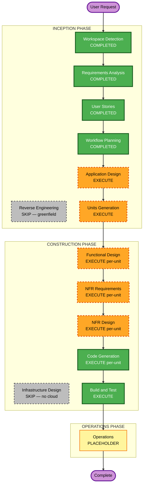

# Execution Plan — android_bridge

## Detailed Analysis Summary

### Project Type
- **Greenfield** — two new native apps (macOS + Android) plus a shared local device-link protocol. No existing code, no system to migrate.

### Change Impact Assessment
- **User-facing changes**: Yes — every feature is user-facing on both devices.
- **Structural changes**: Yes — entire architecture is new (two apps + protocol/transport layer).
- **Data model changes**: Yes — new wire-protocol message schemas, local caches (messages, contacts, call history), pairing/trust store.
- **API changes**: Yes — the device-link protocol *is* the contract between the two apps (no external/cloud API).
- **NFR impact**: Yes — security (enabled, blocking), privacy (local-only), performance (mirroring latency), testability (partial PBT).

### Risk Assessment
- **Risk Level**: **Medium**. Greenfield (no production system to break, easy to iterate), single primary user — but technically complex (telephony, notifications, screen capture, Bluetooth, mTLS, real-time streaming across two OSes).
- **Rollback Complexity**: Easy — nothing in production; changes are additive.
- **Testing Complexity**: Moderate-to-Complex — cross-device integration, real-time media, OS-permission-gated features; mitigated by per-feature stories + PBT on the protocol.

---

## Workflow Visualization

---

## Phases to Execute

### 🔵 INCEPTION PHASE
- [x] Workspace Detection (COMPLETED)
- [x] Reverse Engineering (SKIPPED — greenfield, no existing code)
- [x] Requirements Analysis (COMPLETED)
- [x] User Stories (COMPLETED)
- [x] Workflow Planning (IN PROGRESS)
- [ ] **Application Design — EXECUTE**
  - **Rationale**: Entirely new system. We must define the major components (Mac app, Android app, shared device-link protocol/transport), their responsibilities, key methods, and dependencies before decomposing into units.
- [ ] **Units Generation — EXECUTE**
  - **Rationale**: The system is large and naturally decomposes into multiple units (protocol/transport core, pairing/security, per-feature modules, the two app shells). A structured unit breakdown with dependencies is needed to drive per-unit construction.

### 🟢 CONSTRUCTION PHASE (per-unit unless noted)
- [ ] **Functional Design — EXECUTE (per-unit)**
  - **Rationale**: New data models (protocol messages, caches), business logic, and state machines (pairing handshake, call state). Also required to satisfy **PBT-01** property identification for the partial-PBT scope.
- [ ] **NFR Requirements — EXECUTE (per-unit)**
  - **Rationale**: Security extension is enabled (blocking); performance targets exist (mirroring latency); tech-stack selections incl. the **PBT framework (PBT-09)** must be recorded.
- [ ] **NFR Design — EXECUTE (per-unit)**
  - **Rationale**: mTLS/pairing design, secure storage, input-validation/safe-deserialization patterns, supply-chain (dep pinning, SBOM) and logging-without-PII must be designed in, not bolted on.
- [ ] **Infrastructure Design — SKIP**
  - **Rationale**: No cloud/server infrastructure — fully local peer-to-peer, no relay, no backend. Build/packaging/codesigning/CI concerns are folded into NFR Design (supply chain) and Build & Test. *Revisit only if a remote-relay feature is ever added (currently out of scope).*
- [ ] **Code Generation — EXECUTE (ALWAYS, per-unit)**
  - **Rationale**: Implementation planning + code generation for each unit.
- [ ] **Build and Test — EXECUTE (ALWAYS)**
  - **Rationale**: Build instructions, integration/E2E tests, and PBT execution with seed logging (PBT-08).

### 🟡 OPERATIONS PHASE
- [ ] Operations — PLACEHOLDER (future deployment/monitoring; not in scope for this local app v1)

---

## Estimated Scope
- **Stages to execute**: Application Design, Units Generation, then per-unit (Functional Design → NFR Requirements → NFR Design → Code Generation) × N units, then Build & Test.
- **Stages skipped**: Reverse Engineering (greenfield), Infrastructure Design (no cloud).
- **Units (preliminary, finalized in Units Generation)**: likely ~ device-link protocol/transport core · pairing & security · connection/discovery + Android foreground service · notifications · SMS · file transfer · clipboard · screen mirroring · calls · Mac app shell/UI · Android app shell/UI. Exact set decided in Units Generation.

## Success Criteria
- **Primary Goal**: A working, local-only Android↔Mac continuity hub delivering all `[v1]` stories with native Mac polish.
- **Key Deliverables**: macOS (SwiftUI) app, Android (Kotlin/Compose) app, documented shared protocol, test suites (integration/E2E + partial PBT).
- **Quality Gates**: All `[v1]` story acceptance criteria pass; Security baseline compliant (no blocking findings); protocol round-trip PBT green; mirroring latency target met on LAN.
