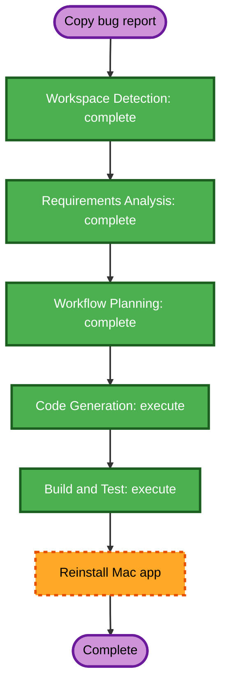

# File Notification Copy Execution Plan

## Detailed Analysis Summary

### Transformation Scope
- **Transformation type**: Single-component bug fix
- **Primary change**: Update the Mac custom toast Copy action to use the received file's `path` metadata for file notifications.
- **Related components**: `BridgeApp` toast presentation and existing `BridgeCore` notification metadata.

### Change Impact Assessment
- **User-facing changes**: Yes. Copy returns the useful absolute file path.
- **Structural changes**: No.
- **Data model changes**: No.
- **API/protocol changes**: No.
- **NFR impact**: No.

### Component Relationships
- **Primary component**: `mac/Sources/BridgeApp/main.swift`
- **Supporting component**: `mac/Sources/BridgeCore/LinkManager.swift` already supplies `action=openFile` and `path`.
- **Change priority**: Patch.

### Risk Assessment
- **Risk level**: Low
- **Rollback complexity**: Easy
- **Testing complexity**: Simple

## Workflow Visualization

### Text Alternative
1. Workspace Detection: complete
2. Requirements Analysis: complete
3. Workflow Planning: complete
4. Code Generation: execute
5. Build and Test: execute
6. Reinstall and relaunch `/Applications/AndroidBridge.app`

## Phases

### Inception
- [x] Workspace Detection
- [x] Reverse Engineering skipped; existing design artifacts are sufficient
- [x] Requirements Analysis
- [x] User Stories skipped; isolated bug with explicit acceptance criteria
- [x] Workflow Planning
- [ ] Application Design skipped; no new component or method
- [ ] Units Generation skipped; single-line UI behavior change

### Construction
- [ ] Functional Design skipped; no business logic
- [ ] NFR Requirements skipped; existing stack and NFRs remain unchanged
- [ ] NFR Design skipped
- [ ] Infrastructure Design skipped
- [ ] Code Generation execute
- [ ] Build and Test execute
- [ ] Build, sign, reinstall, and relaunch Mac app

## Package Change Sequence
1. Update `BridgeApp` toast Copy action.
2. Run the existing Swift tests and build.
3. Build the release app, sign with the existing project identity, install at `/Applications/AndroidBridge.app`, and relaunch.

## Success Criteria
- File notification Copy writes the exact absolute path.
- Notification click still opens the file.
- Non-file notification Copy still writes visible body text.
- `swift test` and `swift build` pass.
- Installed Mac app launches.

## Extension Compliance
- **Security Baseline**: Compliant; no new storage, network, input, credential, or dependency behavior. Local path reaches the local pasteboard only after explicit click.
- **Property-Based Testing partial mode**: Enforced PBT transformation rules are N/A. Existing SwiftCheck setup remains compliant with PBT-09.
- **Resiliency Baseline**: Disabled; skipped.
