# Execution Plan — Meeting Completion and Calendar Enrichment

## Detailed Analysis

- **Project type**: Brownfield macOS/Android monorepo.
- **Transformation type**: Focused macOS feature increment.
- **Primary changes**: Non-blocking meeting finalization, native EventKit reads, local calendar snapshots, candidate selection, customer inference, and explicit Second Brain transfer.
- **Affected components**: `BridgeCore` meeting store/recorder/link manager, `BridgeApp` Meetings UI, macOS app bundle metadata, Swift tests.
- **Protocol impact**: No new message types; phone stop handling becomes asynchronous on Mac.
- **Infrastructure impact**: None.
- **Risk level**: Medium because recording lifecycle and local private calendar data are affected.
- **Rollback complexity**: Easy; Mac-only code and metadata changes.
- **Testing complexity**: Moderate; pure matching/inference tests plus build and manual permission/event validation.

## Component Relationships

- **Meeting recorder** stops capture and queues final processing.
- **Meeting store** persists state, end time, and selected calendar snapshot.
- **Calendar service** reads EventKit and returns bounded local event snapshots.
- **Link manager** coordinates finalization, enrichment, retries, and UI state.
- **Meetings UI** shows status, candidate selection, manual edit, and explicit Second Brain transfer.

## Module Update Strategy

1. Add pure calendar domain/matching logic and tests.
2. Add MeetingStore processing/calendar persistence.
3. Make Mac and phone stop paths non-blocking.
4. Add EventKit adapter and LinkManager orchestration.
5. Replace automatic completion sheet with inline meeting actions.
6. Add calendar usage descriptions, build, test, install, and relaunch.

## Workflow Visualization

```mermaid
flowchart TD
    Start(["Feature Request"]) --> WD["Workspace Detection: COMPLETED"]
    WD --> RA["Requirements Analysis: COMPLETED"]
    RA --> US["User Stories: COMPLETED"]
    US --> WP["Workflow Planning: COMPLETED"]
    WP --> AD["Application Design: EXECUTE"]
    AD --> UG["Units Generation: EXECUTE"]
    UG --> FD["Functional Design: EXECUTE"]
    FD --> NR["NFR Requirements: EXECUTE"]
    NR --> ND["NFR Design: EXECUTE"]
    ND --> ID["Infrastructure Design: SKIP"]
    ID --> CG["Code Generation: EXECUTE"]
    CG --> BT["Build and Test: EXECUTE"]
    BT --> End(["Complete"])
    style WD fill:#4CAF50,stroke:#1B5E20,stroke-width:3px,color:#fff
    style RA fill:#4CAF50,stroke:#1B5E20,stroke-width:3px,color:#fff
    style US fill:#4CAF50,stroke:#1B5E20,stroke-width:3px,color:#fff
    style WP fill:#4CAF50,stroke:#1B5E20,stroke-width:3px,color:#fff
    style AD fill:#FFA726,stroke:#E65100,stroke-width:3px,stroke-dasharray:5 5,color:#000
    style UG fill:#FFA726,stroke:#E65100,stroke-width:3px,stroke-dasharray:5 5,color:#000
    style FD fill:#FFA726,stroke:#E65100,stroke-width:3px,stroke-dasharray:5 5,color:#000
    style NR fill:#FFA726,stroke:#E65100,stroke-width:3px,stroke-dasharray:5 5,color:#000
    style ND fill:#FFA726,stroke:#E65100,stroke-width:3px,stroke-dasharray:5 5,color:#000
    style ID fill:#BDBDBD,stroke:#424242,stroke-width:2px,stroke-dasharray:5 5,color:#000
    style CG fill:#4CAF50,stroke:#1B5E20,stroke-width:3px,color:#fff
    style BT fill:#4CAF50,stroke:#1B5E20,stroke-width:3px,color:#fff
    style Start fill:#CE93D8,stroke:#6A1B9A,stroke-width:3px,color:#000
    style End fill:#CE93D8,stroke:#6A1B9A,stroke-width:3px,color:#000
    linkStyle default stroke:#333,stroke-width:2px
```

### Text Alternative

Requirements and stories are complete. Execute Application Design, Units Generation, Functional Design, NFR Requirements, NFR Design, Code Generation, and Build/Test. Skip Infrastructure Design because this increment uses only local macOS platform APIs and existing local storage.

## Stage Decisions

### Inception

- [x] Workspace Detection — completed.
- [x] Requirements Analysis — completed and approved.
- [x] User Stories — completed under explicit autonomous authorization.
- [x] Workflow Planning — completed under explicit autonomous authorization.
- [x] Application Design — execute; two new logical responsibilities and orchestration are needed.
- [x] Units Generation — execute; define one cohesive Mac unit for state, EventKit, and UI changes.

### Construction

- [x] Functional Design — execute; matching, inference, state, and retry rules need definition.
- [x] NFR Requirements — execute; privacy, responsiveness, and permission boundaries are material.
- [x] NFR Design — execute; background queues, snapshots, and fail-safe behavior need explicit patterns.
- [x] Infrastructure Design — skip; no cloud or deployment infrastructure changes.
- [x] Code Generation — completed.
- [x] Build and Test — completed; app signed, installed, and relaunched.

## Success Criteria

- Stop returns immediately and does not block navigation or link receive handling.
- No automatic finished-meeting/Second Brain sheet appears.
- Google calendars configured in macOS are readable through EventKit after permission.
- Zero, one, and multiple overlapping-event cases work, including manual entry.
- Customer inference is conservative and local.
- Tests/build pass and `/Applications/AndroidBridge.app` is rebuilt, signed, installed, and relaunched.

## Extension Compliance

- **Security**: Enabled; calendar data remains local, permission is read-only, sensitive details are not logged.
- **Resiliency**: Disabled.
- **Partial PBT**: Matching/inference invariants use existing SwiftCheck support.
- **Blocking findings**: None.
