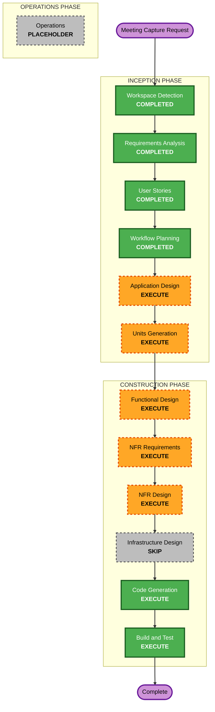

# Execution Plan — Meeting Capture Feature Increment

## Detailed Analysis Summary

### Transformation Scope
- **Transformation Type**: Multi-component feature addition in a brownfield monorepo.
- **Primary Changes**: Add a new Meeting Capture capability spanning Android capture, protocol message types, Mac processing, local ML integrations, notes export, and sharing.
- **Related Components**:
  - `protocol/PROTOCOL.md`
  - `protocol/kotlin`
  - `protocol/swift`
  - `android/app` foreground capture service, UI, media queue, permissions
  - `mac/Sources/BridgeCore` feature logic, processing pipeline, notes/export services
  - `mac/Sources/BridgeApp` SwiftUI views for sessions, progress, speaker rename, notes preview/share
  - New project-local Whisper/Ollama integration assets/configuration

### Change Impact Assessment
- **User-facing changes**: Yes — new Android recording/photo workflow and Mac notes review/share workflow.
- **Structural changes**: Yes — new feature plugin and local processing pipeline.
- **Data model changes**: Yes — meeting session, audio chunk, photo, transcript segment, speaker label, notes output models.
- **API/protocol changes**: Yes — new `meeting.*` control messages and binary stream use for chunks/photos.
- **NFR impact**: Yes — privacy-sensitive media, local ML dependencies, background recording reliability, reconnect queueing, PBT/security validation.

### Component Relationships
- **Primary Component**: New MeetingCapturePlugin across Android + Mac.
- **Shared Components**: Device-Link Protocol codecs/registry, stream framing, LinkManager/MessageRouter.
- **Dependent Components**: Android shell, Mac shell, settings/permissions, existing link service.
- **Supporting Components**: LinkLogger, filesystem storage, local process execution for Whisper/Ollama.

### Risk Assessment
- **Risk Level**: High.
- **Rollback Complexity**: Moderate — feature can be toggled/isolated but protocol and app UI changes touch both apps.
- **Testing Complexity**: Complex — requires unit tests, protocol PBT, local Mac processing tests, Android recording tests, and hardware/manual validation.

## Module Update Strategy

- **Update Approach**: Sequential foundation-first.
- **Critical Path**: Protocol models → pure domain models/storage → Android capture/queue → Mac ingestion → Mac processing → UI/share.
- **Coordination Points**: `meetingId`, chunk sequence/checksum, stream IDs, timestamp units, file naming, phone-side delete acknowledgements.
- **Testing Checkpoints**:
  1. Protocol round-trip PBT green in Kotlin and Swift.
  2. Pure timestamp placement and chunk queue tests green.
  3. Mac local Whisper/Ollama smoke test green.
  4. Android APK builds with recording permissions/service.
  5. End-to-end manual test on phone + Mac.

## Workflow Visualization

### Text Alternative

1. Workspace Detection — completed.
2. Requirements Analysis — completed.
3. User Stories — completed.
4. Workflow Planning — completed.
5. Application Design — execute.
6. Units Generation — execute.
7. Per-unit Functional Design — execute.
8. Per-unit NFR Requirements — execute.
9. Per-unit NFR Design — execute.
10. Infrastructure Design — skip; no cloud/server infrastructure.
11. Code Generation — execute.
12. Build and Test — execute.

## Phases to Execute

### INCEPTION PHASE
- [x] Workspace Detection — completed.
- [x] Requirements Analysis — completed.
- [x] User Stories — completed.
- [x] Workflow Planning — completed.
- [ ] Application Design — EXECUTE
  - **Rationale**: New plugin/service boundaries are required: Android recorder/photo capture/queue, protocol extensions, Mac ingestion/transcription/diarization/notes/export.
- [ ] Units Generation — EXECUTE
  - **Rationale**: Work must be decomposed across protocol, Android, Mac processing, UI, and tests.

### CONSTRUCTION PHASE
- [ ] Functional Design — EXECUTE
  - **Rationale**: Requires data models, state machines, queue semantics, timestamp placement, speaker rename behavior, and notes generation rules.
- [ ] NFR Requirements — EXECUTE
  - **Rationale**: Security, privacy, local ML dependency management, background recording, reconnect reliability, and performance need explicit decisions.
- [ ] NFR Design — EXECUTE
  - **Rationale**: Need concrete patterns for safe process execution, local storage, no-PII logging, idempotent chunk handling, and testability.
- [ ] Infrastructure Design — SKIP
  - **Rationale**: No cloud/server infrastructure; this remains local P2P plus local Mac tooling.
- [ ] Code Generation — EXECUTE
  - **Rationale**: Implementation and tests are required across multiple packages.
- [ ] Build and Test — EXECUTE
  - **Rationale**: Must validate Swift/Kotlin builds, protocol tests, local ML smoke tests, and manual phone/Mac behavior.

## Proposed Units of Work

### MC-U1 — Protocol and Shared Meeting Models
- Add `meeting.*` message types, schemas, Swift/Kotlin models, registry validation, interop vectors, and PBT.
- Depends on existing U1 Protocol/Transport.

### MC-U2 — Android Meeting Capture Service
- Add foreground microphone recording service, one-minute chunk segmentation, pause/resume/stop, permissions, and session state.
- Depends on MC-U1.

### MC-U3 — Android Photo Capture and Transfer Queue
- Add in-session camera capture, timestamped photo metadata, queued transfer, confirmation-based deletion for audio/photos.
- Depends on MC-U1 and MC-U2.

### MC-U4 — Mac Meeting Ingestion and Storage
- Receive session/chunk/photo messages, persist meeting workspace, deduplicate chunks, acknowledge receipt, expose processing state.
- Depends on MC-U1.

### MC-U5 — Mac Local Transcription and Speaker Pipeline
- Import project-local Whisper tooling, run chunk transcription, add speaker labels/rename model, and local processing error/retry.
- Depends on MC-U4.

### MC-U6 — Mac Summary, Notes, and Image Placement
- Use Ollama Gemma for local notes, place images by nearest timestamp, regenerate after speaker rename, save Markdown folder.
- Depends on MC-U5.

### MC-U7 — Android and Mac UI Integration
- Add Android meeting capture UI; add Mac session/progress/notes/speaker/share views and native share sheet integration.
- Depends on MC-U2 through MC-U6.

### MC-U8 — Build, Tests, and Hardware Validation
- Add unit/PBT/integration tests, local ML smoke tests, build instructions, and phone+Mac validation checklist.
- Depends on MC-U1 through MC-U7.

## Package Change Sequence

1. `protocol/PROTOCOL.md`, `protocol/kotlin`, `protocol/swift` — establish contract first.
2. `mac/Sources/BridgeCore` pure models/storage/ingestion — enables processing tests without Android hardware.
3. `android/app` service/queue/photo capture — capture and send to contract.
4. `mac` local Whisper/Ollama pipeline — process received data.
5. `mac/Sources/BridgeApp` and Android Compose UI — expose user workflow.
6. Test/build documentation — validate everything.

## Success Criteria

- Android records in background and chunks audio every minute.
- Chunks/photos transfer over existing encrypted link with acknowledgements.
- Phone deletes confirmed raw media copies.
- Mac transcribes locally with project-local Whisper integration.
- Mac generates local Gemma notes with speaker labels and renamed speakers.
- Photos appear inline near correct transcript timestamps.
- Markdown folder save and native share flow work.
- Protocol PBT and normal test suites pass.

## Security Compliance Summary

- SECURITY-01: Compliant by design; existing mTLS link and secure key storage remain required.
- SECURITY-03: Applicable; no transcript/audio/image content in logs.
- SECURITY-05/13: Applicable; new protocol schemas and size/checksum validation required.
- SECURITY-08/15: Applicable; paired-device-only actions, fail-closed malformed messages.
- SECURITY-10: Applicable; Whisper/diarization/Ollama integration dependencies must be pinned and documented.
- SECURITY-12: Applicable; no hardcoded credentials.
- SECURITY-02/04/07: N/A; no web/cloud network intermediaries.

## PBT Compliance Summary

- PBT-02: New protocol messages require Swift and Kotlin round-trip PBT.
- PBT-03: Timestamp placement and chunk/frame invariants require property tests where pure.
- PBT-07: Domain generators required for meeting IDs, timestamps, sequences, checksums.
- PBT-08: Existing seed reproducibility must be preserved.
- PBT-09: Existing Kotest/SwiftCheck framework selection remains valid.

## Estimated Timeline

- **Total planned units**: 8.
- **Recommended implementation order**: sequential with test checkpoints after MC-U1, MC-U4, MC-U6, and MC-U8.
