# Mobile Second Brain Sync Execution Plan

## Detailed Analysis Summary

### Transformation Scope
- **Transformation Type**: Multi-component feature increment.
- **Primary Changes**: Android Second Brain UI/offline store/queue, protocol messages, Mac skill-backed operation bridge, sync scheduler, conflict handling, tests.
- **Related Components**: Android app, Mac BridgeCore, shared Kotlin/Swift protocol, CI/build/test instructions.

### Change Impact Assessment
- **User-facing changes**: Yes — new Android Second Brain screen and sync status.
- **Structural changes**: Yes — new sync models, operation queue, protocol commands, Mac request handler.
- **Data model changes**: Yes — node metadata, content cache, pending operation queue, sync acknowledgements.
- **API changes**: Yes — app protocol gains Second Brain messages.
- **NFR impact**: Yes — security validation, local durability, reconnect reliability, PBT coverage.

### Component Relationships
- **Protocol**: Must define shared Second Brain message schema first.
- **Mac BridgeCore**: Handles authenticated requests and delegates filesystem work to `SecondBrainStore`/skill.
- **Android App**: Stores cache/queue and presents UI.
- **Tests**: Protocol round-trip PBT, sync model/state tests, Android unit/UI-adjacent tests, Mac handler tests.

### Risk Assessment
- **Risk Level**: Medium-High.
- **Rollback Complexity**: Moderate — prior app artifacts can be reinstalled; feature can be disabled if implemented behind setting.
- **Testing Complexity**: Complex — needs pure tests plus manual paired-device validation.

## Workflow Visualization

```mermaid
flowchart TD
    Start(["Mobile Second Brain request"])
    WD["Workspace Detection<br/><b>COMPLETED</b>"]
    RA["Requirements Analysis<br/><b>COMPLETED</b>"]
    US["User Stories<br/><b>COMPLETED</b>"]
    WP["Workflow Planning<br/><b>COMPLETED</b>"]
    AD["Application Design<br/><b>EXECUTE</b>"]
    UG["Units Generation<br/><b>EXECUTE</b>"]
    FD["Functional Design<br/><b>EXECUTE</b>"]
    NFRA["NFR Requirements<br/><b>EXECUTE</b>"]
    NFRD["NFR Design<br/><b>EXECUTE</b>"]
    ID["Infrastructure Design<br/><b>SKIP</b>"]
    CG["Code Generation<br/><b>EXECUTE</b>"]
    BT["Build and Test<br/><b>EXECUTE</b>"]
    OPS["Operations<br/><b>PLACEHOLDER</b>"]
    End(["Complete"])

    Start --> WD --> RA --> US --> WP --> AD --> UG --> FD --> NFRA --> NFRD --> ID --> CG --> BT --> OPS --> End

    style WD fill:#4CAF50,stroke:#1B5E20,stroke-width:3px,color:#fff
    style RA fill:#4CAF50,stroke:#1B5E20,stroke-width:3px,color:#fff
    style US fill:#4CAF50,stroke:#1B5E20,stroke-width:3px,color:#fff
    style WP fill:#4CAF50,stroke:#1B5E20,stroke-width:3px,color:#fff
    style AD fill:#FFA726,stroke:#E65100,stroke-width:3px,stroke-dasharray: 5 5,color:#000
    style UG fill:#FFA726,stroke:#E65100,stroke-width:3px,stroke-dasharray: 5 5,color:#000
    style FD fill:#FFA726,stroke:#E65100,stroke-width:3px,stroke-dasharray: 5 5,color:#000
    style NFRA fill:#FFA726,stroke:#E65100,stroke-width:3px,stroke-dasharray: 5 5,color:#000
    style NFRD fill:#FFA726,stroke:#E65100,stroke-width:3px,stroke-dasharray: 5 5,color:#000
    style ID fill:#BDBDBD,stroke:#424242,stroke-width:2px,stroke-dasharray: 5 5,color:#000
    style CG fill:#FFA726,stroke:#E65100,stroke-width:3px,stroke-dasharray: 5 5,color:#000
    style BT fill:#4CAF50,stroke:#1B5E20,stroke-width:3px,color:#fff
    style OPS fill:#BDBDBD,stroke:#424242,stroke-width:2px,stroke-dasharray: 5 5,color:#000
    style Start fill:#CE93D8,stroke:#6A1B9A,stroke-width:3px,color:#000
    style End fill:#CE93D8,stroke:#6A1B9A,stroke-width:3px,color:#000
    linkStyle default stroke:#333,stroke-width:2px
```

### Text Alternative

1. Workspace Detection — completed.
2. Requirements Analysis — completed.
3. User Stories — completed.
4. Workflow Planning — completed.
5. Application Design — execute.
6. Units Generation — execute.
7. Per-unit Functional Design — execute.
8. Per-unit NFR Requirements — execute.
9. Per-unit NFR Design — execute.
10. Infrastructure Design — skip, no cloud/server infrastructure.
11. Code Generation — execute.
12. Build and Test — execute.
13. Operations — placeholder.

## Phases to Execute

### INCEPTION
- [x] Workspace Detection — completed.
- [x] Requirements Analysis — completed.
- [x] User Stories — completed.
- [x] Workflow Planning — completed.
- [ ] Application Design — **EXECUTE**
  - **Rationale**: New Android/Mac/protocol components and method boundaries needed.
- [ ] Units Generation — **EXECUTE**
  - **Rationale**: Split protocol, Mac bridge, Android cache/queue, Android UI, and tests into manageable units.

### CONSTRUCTION
- [ ] Functional Design — **EXECUTE**
  - **Rationale**: Sync algorithm, conflict policy, queue replay, and local search need detailed logic.
- [ ] NFR Requirements — **EXECUTE**
  - **Rationale**: Security, resiliency, and full PBT are enabled.
- [ ] NFR Design — **EXECUTE**
  - **Rationale**: Need validation, durable queue, logging, timeouts, idempotency, and PBT design.
- [ ] Infrastructure Design — **SKIP**
  - **Rationale**: Local peer-to-peer app; no cloud/server infrastructure.
- [ ] Code Generation — **EXECUTE**
  - **Rationale**: Implementation and tests needed.
- [ ] Build and Test — **EXECUTE**
  - **Rationale**: Android, Mac, protocol, PBT, and manual device validation instructions needed.

## Package Change Sequence

1. `protocol/` — add Second Brain messages and round-trip tests.
2. `mac/` — add protocol handlers and skill-backed sync operations.
3. `android/` — add local models/cache/queue/sync engine.
4. `android/` — add Second Brain UI.
5. Integrated tests/build instructions.

## Success Criteria

- Android can browse/read/create/edit/delete Markdown nodes from local cache.
- Android syncs bidirectionally every 2 minutes and via Sync Now.
- Pending Android changes survive restart and replay automatically on reconnect.
- Mac performs real filesystem operations through existing Second Brain skill boundary.
- Last-write-wins conflict handling is deterministic.
- All protocol inputs are validated and secure-channel-only.
- PBT and example tests cover protocol, queue, idempotency, conflict, and sync model behavior.

## Compliance Summary

### Security
Applicable security requirements included in requirements and must be carried into design/code. No blocking planning finding.

### Resiliency
Local/personal-use resiliency requirements included. Cloud-production items are N/A. No blocking planning finding.

### PBT
Full PBT required in downstream functional design/code generation. No blocking planning finding.
