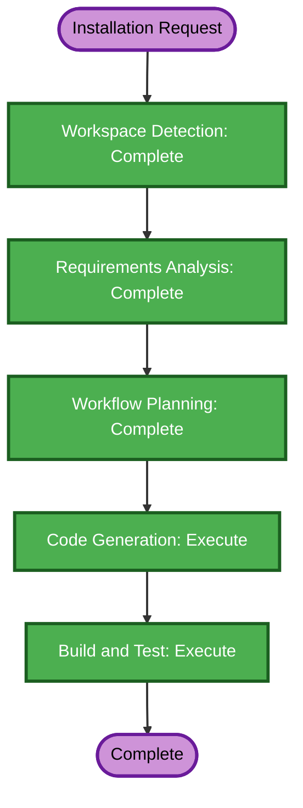

# One-Line Installation Execution Plan

## Detailed Analysis Summary

- **Transformation type**: Isolated distribution tooling change.
- **Primary changes**: Installer script, GitHub release workflow, release packaging/checksum, README instructions.
- **User-facing impact**: Adds a one-command macOS installation path.
- **Structural, data model, and API changes**: None.
- **Security impact**: Release integrity and trusted transport must be enforced.
- **Risk level**: Low.
- **Rollback complexity**: Easy; remove installer/release workflow and documentation.
- **Testing complexity**: Simple shell validation plus release artifact smoke checks.

## Component Relationships

- `mac/scripts/make-macos-app.sh` builds the application bundle.
- The GitHub Actions release workflow packages the bundle and publishes its checksum.
- The public installer resolves a GitHub release, verifies the package, and copies the app into `/Applications`.
- `README.md` exposes the canonical installer command.

## Workflow Visualization

### Text Alternative

1. Workspace Detection: complete.
2. Requirements Analysis: complete.
3. Workflow Planning: complete.
4. Code Generation: execute.
5. Build and Test: execute.

## Phase Decisions

### Inception
- [x] Workspace Detection — completed.
- [x] Reverse Engineering — skipped; existing project documentation is current.
- [x] Requirements Analysis — completed.
- [x] User Stories — skipped; isolated developer/distribution tooling change.
- [x] Workflow Planning — completed.
- [x] Application Design — skipped; no application component or service changes.
- [x] Units Generation — skipped; one straightforward implementation unit.

### Construction
- [x] Functional Design — skipped; no business logic or data model changes.
- [x] NFR Requirements — skipped; security requirements are already explicit.
- [x] NFR Design — skipped; no new architecture patterns are needed.
- [x] Infrastructure Design — skipped; GitHub Actions configuration is implementation tooling, not application infrastructure.
- [ ] Code Generation — execute.
- [ ] Build and Test — execute.

## Implementation Sequence

1. Add the public macOS installer script.
2. Add GitHub Actions release packaging and checksum publication.
3. Document the canonical one-line command in `README.md`.
4. Validate shell syntax and installer failure behavior.
5. Build/package the macOS app and verify archive/checksum compatibility.

## Success Criteria

- A clean Apple Silicon Mac can run one documented command to install the latest release.
- The installer downloads only over HTTPS and rejects a checksum mismatch.
- Existing installations can be replaced.
- Failures return non-zero status with actionable messages.
- Release workflow and local validation checks pass.

## Extension Compliance

- **Security Baseline**: Compliant by plan; HTTPS and checksum verification are blocking requirements.
- **Resiliency Baseline**: Disabled, skipped.
- **Property-Based Testing**: N/A for shell/release integration tooling.
